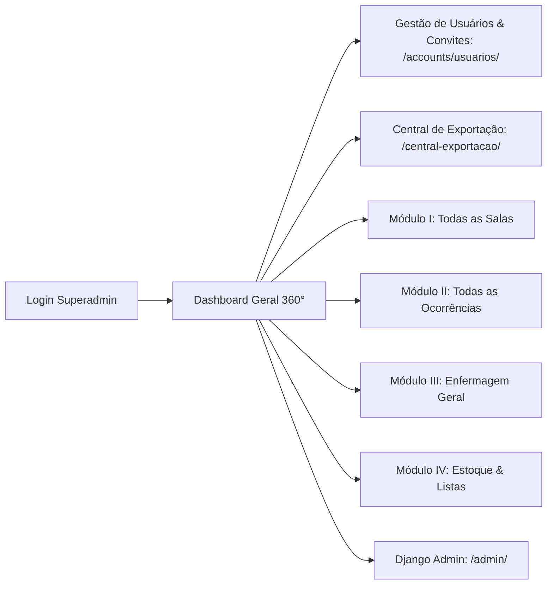
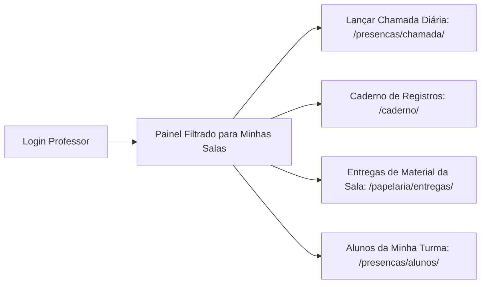

# 👥 01. Perfis, Permissões e Fluxos de Navegação

Este documento estabelece as regras de controle de acesso (RBAC), matriz de permissões e os caminhos de navegação para cada tipo de usuário no SEAMI.

---

## 🔐 1. Perfis de Usuário no Sistema

O SEAMI possui 6 perfis funcionais definidos no enum `UserRole` (`accounts/models.py`):

| Perfil (`role`) | Nome de Exibição | Escopo de Visão | Responsabilidades Principais |
| :--- | :--- | :--- | :--- |
| `MASTER_ADMIN` | **Master Admin (Superadmin)** | **Global (Todas as salas e módulos)** | Acesso irrestrito a configurações, Django Admin, gestão de todos os usuários, exclusão de dados e relatórios globais. |
| `DIRETOR` | **Diretor(a)** | **Institucional Completo** | Gestão institucional, auditoria, convite/gerenciamento de funcionários, central de exportação e monitoramento de riscos. |
| `COORDENADOR` | **Coordenador(a)** | **Pedagógico Geral** | Gestão pedagógica, supervisão de chamadas de todas as turmas, gestão de estoque de papelaria e relatórios analíticos. |
| `ENFERMEIRA` | **Enfermeira** | **Saúde & Apoio Geral** | Prontuário de saúde, triagens, administração de medicamentos, registro de atestados médicos e afastamentos clínicos. |
| `PROFESSOR` | **Professor(a)** | **Apenas Salas Vinculadas** | Lançamento diário de chamada, registro de ocorrências e entregas de materiais dos alunos de suas salas atribuídas. |
| `AUXILIAR` | **Auxiliar** | **Salas Atribuídas / Apoio** | Consulta de presenças e auxílio no lançamento do diário de chamada sob orientação docente. |

---

## 🧭 2. Fluxo e Caminhos do Superadmin / Diretor

O Superadmin e a Direção possuem visão 360° de toda a instituição.

### 2.1. Mapa de Navegação do Superadmin

### 2.2. Ações Exclusivas do Administrador Master / Diretor:
1. **Gestão de Usuários e Convites (`/accounts/usuarios/`)**:
   - Enviar convite com link seguro por e-mail e token com validade de 48h.
   - Atribuir o perfil correto (`Professor`, `Enfermeira`, `Diretor`, etc.).
   - Vincular professores e auxiliares às suas respectivas salas de aula (`Turma.professores` / `Turma.auxiliares`).
   - Ativar, desativar ou redefinir senhas de acesso.
2. **Central de Exportação Consolidada (`/central-exportacao/`)**:
   - Extração de planilhas Excel (.xlsx) e relatórios em PDF de todas as salas, períodos, frequência e atendimentos médicos.
3. **Gestão Estrutural de Alunos (`/presencas/alunos/`)**:
   - Matrícula de novas crianças, alteração de sala de aula e processamento de desligamentos com data agendada.

---

## 👩‍🏫 3. Fluxo e Caminhos do Professor

O Professor possui uma interface focada em suas turmas, garantindo privacidade entre as salas e produtividade na sala de aula.

### 3.1. Mapa de Navegação do Professor

### 3.2. Regras de Isolamento e Segurança do Professor:
- **Turmas Vinculadas**: O professor só visualiza alunos e lança chamadas para as turmas nas quais seu usuário está explicitamente cadastrado na lista de `Turma.professores`.
- **Aviso de Turma Não Vinculada**: Se o professor logar e não tiver turmas associadas, o sistema exibe um alerta orientando o contato com a Direção.
- **Chamada Inteligente**: Ao abrir a tela de chamada (`/presencas/chamada/`), o sistema preenche automaticamente suas turmas e pré-carrega faltas/atestados já informados pela Enfermagem ou Secretaria.

---

## 📊 4. Matriz Completa de Permissões por Módulo

| Funcionalidade / Recurso | Master Admin | Diretor | Coordenador | Enfermeira | Professor | Auxiliar |
| :--- | :---: | :---: | :---: | :---: | :---: | :---: |
| **Visualizar Dashboard Global** | ✅ Sim | ✅ Sim | ✅ Sim | ✅ Sim | 🔒 Suas Salas | 🔒 Suas Salas |
| **Lançar Chamada Diária** | ✅ Sim | ✅ Sim | ✅ Sim | ❌ Não | ✅ Suas Salas | ✅ Suas Salas |
| **Cadastrar / Editar Alunos** | ✅ Sim | ✅ Sim | ✅ Sim | ❌ Não | 🔒 Visualizar | 🔒 Visualizar |
| **Desligar Aluno** | ✅ Sim | ✅ Sim | ❌ Não | ❌ Não | ❌ Não | ❌ Não |
| **Lançar Ocorrência no Caderno** | ✅ Sim | ✅ Sim | ✅ Sim | ✅ Sim | ✅ Suas Salas | ✅ Suas Salas |
| **Atendimento de Enfermagem** | ✅ Sim | ✅ Sim | ❌ Não | ✅ Sim | ❌ Não | ❌ Não |
| **Movimentar Estoque Papelaria** | ✅ Sim | ✅ Sim | ✅ Sim | ✅ Sim | ❌ Não | ❌ Não |
| **Registrar Entrega de Kit aos Alunos** | ✅ Sim | ✅ Sim | ✅ Sim | ❌ Não | ✅ Suas Salas | ❌ Não |
| **Gerenciar Usuários & Convites** | ✅ Sim | ✅ Sim | ❌ Não | ❌ Não | ❌ Não | ❌ Não |
| **Painel Django Admin (`/admin`)** | ✅ Sim | 🔒 Staff | ❌ Não | ❌ Não | ❌ Não | ❌ Não |
