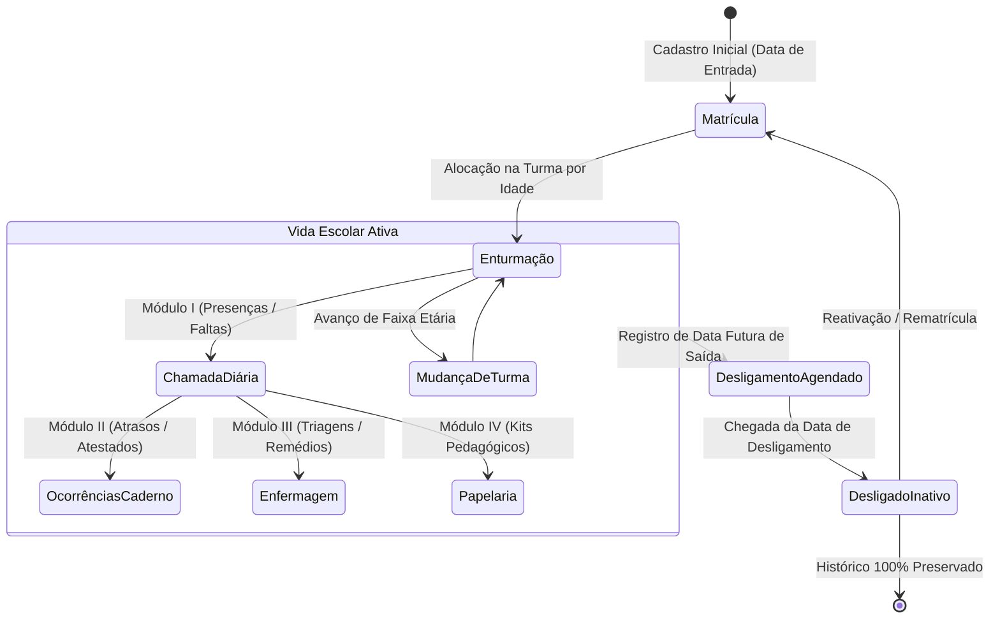

# 👶 02. Ciclo de Vida do Aluno

Este documento descreve todo o ciclo de vida do aluno dentro da instituição SEAMI, desde o seu ingresso e matrícula até a sua transição entre salas, acompanhamento pedagógico/saúde e eventual desligamento.

---

## 🔄 Visão Geral do Ciclo

---

## 📝 1. Matrícula e Entrada do Aluno

### 1.1. Cadastro da Criança (`/presencas/alunos/`)
Para registrar uma nova matrícula no sistema:
1. Acesse o menu lateral **Alunos** ou o botão **+ Nova Matrícula**.
2. Preencha os campos obrigatórios:
   - **Nome Completo**: Nome da criança.
   - **Data de Nascimento**: Utilizada para cálculo dinâmico de faixa etária.
   - **Data de Entrada / Matrícula**: Data oficial de início das atividades no SEAMI.
   - **Turno**: `Integral`, `Matutino` ou `Vespertino`.
   - **Turma / Sala de Aula**: Seleção da sala inicial.
   - **Responsáveis e Contato**: Nome dos pais, telefones de emergência e e-mails.
   - **Observações Médicas / Restrições**: Alergias, intolerâncias alimentares ou recomendações.

---

## 🏫 2. Distribuição por Salas e Faixas Etárias

A instituição organiza as turmas em uma progressão estrita por faixa etária:

| Ordem | Sala / Turma | Faixa Etária Típica | Emoji de Identidade | Cor Visual |
| :---: | :--- | :--- | :---: | :--- |
| **1** | **Sala Amizade** | 6 a 12 meses (Berçário I) | 🎨 | Roxo Suave (`#7c3aed`) |
| **2** | **Sala União** | 12 a 18 meses (Berçário II) | 🤝 | Âmbar (`#d97706`) |
| **3** | **Sala Felicidade** | 18 a 24 meses (Maternal I) | ✨ | Rosa / Pink (`#db2777`) |
| **4** | **Sala Carinho** | 24 a 30 meses (Maternal II) | 🧸 | Esmeralda (`#059669`) |
| **5** | **Sala Alegria** | 30 a 36 meses (Jardim) | 👶 | Azul Royal (`#2563eb`) |

### 2.1. Transição de Turma (Mudança de Sala)
* Quando o aluno atinge a idade de transição, o Administrador ou Diretor altera o campo `turma` no perfil do aluno.
* **Preservação de Histórico**: As chamadas anteriores e ocorrências do aluno permanecem registradas na sala original em que ocorreram, garantindo a integridade dos relatórios históricos.

---

## 📅 3. Acompanhamento Contínuo Durante o Período Ativo

Durante o período em que o aluno está ativo (`ativo=True`):
1. **Presença Diária**: Aparece na listagem de chamada diária da sua sala em `presencas/chamada/`.
2. **Caderno de Registros**: Permite o apontamento de atrasos com tolerância, atestados médicos de múltiplos dias e saídas antecipadas.
3. **Enfermaria**: Histórico de atendimentos clínicos, medicações prescritas e sintomas.
4. **Papelaria**: Controle de recebimento de kits pedagógicos e materiais de higiene entregues pelos pais.

---

## 🚪 4. Desligamento do Aluno

O encerramento da matrícula pode ser agendado ou imediato:

### 4.1. Processo de Desligamento:
1. No menu **Alunos**, localize a criança e clique em **Editar / Desligar Aluno**.
2. Preencha os dados do encerramento:
   - **Data de Desligamento**: Data final de permanência da criança.
   - **Motivo do Desligamento**: Ex: *Mudança de cidade*, *Transferência escolar*, *Idade limite atingida*, *Solicitação da família*.
   - **Observações Finais**: Parecer pedagógico ou administrativo.

### 4.2. Comportamento Automático do Sistema:
* **Agendamento Futuro**: Se a `data_desligamento` for futura, a criança permanece ativa e participando das chamadas até o último dia agendado.
* **Inativação Automática**: Quando a data de desligamento é atingida (`data_desligamento <= hoje`), a rotina interna do sistema define automaticamente `ativo=False`.
* **Remoção das Chamadas Futuras**: A criança deixa de poluir as listas de chamada subsequentes.
* **Integridade de Dados**: **Nenhum registro histórico é excluído**. Todas as presenças, atestados e prontuários permanecem consultáveis em relatórios retroativos e na Central de Exportação.

---

## ♻️ 5. Reativação / Rematrícula

Caso uma criança desligada retorne à instituição:
1. Acesse **Alunos** e marque o filtro **"Incluir Alunos Inativos / Desligados"**.
2. Abra o cadastro da criança, limpe o campo `data_desligamento` e marque `ativo = True`.
3. Atualize a nova turma e o aluno voltará a constar nas listas de chamada ativas mantendo todo o seu histórico anterior vinculado.
