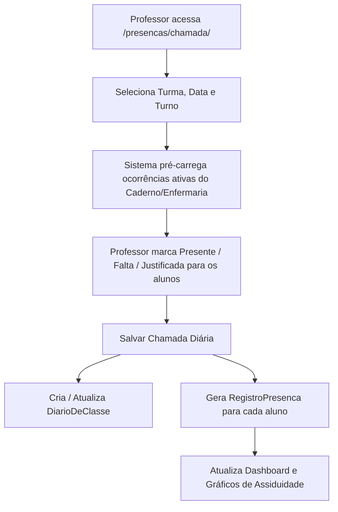

# 📋 03. Módulo I: Controle de Frequência e Chamada Diária

Este documento detalha o funcionamento do **Módulo I**, responsável pelo registro oficial diário de presença infantil, cálculo de assiduidade e emissão de relatórios analíticos.

---

## 🎯 1. Visão Geral e Arquitetura

O controle de presença do SEAMI opera em duas camadas sincronizadas:
1. **`DiarioDeClasse`**: Representa a sessão de chamada realizada pelo professor para uma turma e data específica.
2. **`RegistroPresenca`**: Representa a linha individual de presença/falta de cada aluno no dia, com suporte a turnos (Matutino / Vespertino / Integral).

---

## 📅 2. Lançamento da Chamada (`/presencas/chamada/`)

### 2.1. Seleção de Parâmetros
* **Turma**: Seleção da sala (ex: Felicidade, Carinho). Professores visualizam apenas as salas atribuídas ao seu usuário.
* **Data da Chamada**: Por padrão a data atual (`hoje`), permitindo retroagir caso necessário.
* **Turno da Chamada**: `Integral`, `Matutino` ou `Vespertino`.

### 2.2. Status de Presença (`StatusPresenca`)
Cada aluno recebe uma classificação:

| Status | Código | Significado | Regra de Negócio |
| :--- | :---: | :--- | :--- |
| **Presente** | `PRESENTE` (P) | Criança presente na sala de aula. | Turnos correspondentes marcados como `OK`. |
| **Falta Não Justificada** | `AUSENTE` (F) | Criança não compareceu e a família não informou o motivo. | Conta negativamente na taxa de assiduidade geral. |
| **Falta Justificada** | `JUSTIFICADO` (FJ) | Falta comunicada previamente, atestado médico ou afastamento de enfermagem. | Requer preenchimento de justificativa/motivo. |
| **Presença Parcial** | `PARCIAL` | Presente em apenas um período (ex: matutino presente, vespertino ausente). | Para alunos de turno integral. |
| **Recesso / Feriado** | `RECESSO` / `FERIADO` | Dia letivo suspenso. | Não penaliza a assiduidade dos alunos. |

### 2.3. Ações Rápidas em Massa
* **Marcar Todos como Presentes (P)**: Botão no topo da tabela para preencher todos os alunos da sala com 1 clique.
* **Inversão Rápida**: Clique sobre o badge do aluno para alternar rapidamente entre `Presente`, `Falta` e `Justificada`.

---

## 🔍 3. Consulta de Registros & Relatórios (`/presencas/chamada/consulta/`)

A tela de consulta possui duas abas estruturadas:

### Aba 1: Registros e Exportação (`tab=consulta`)
* **Filtros Flexíveis**:
  * Por Mês de Referência (`month_ref`) ou Intervalo Personalizado (`date_start` e `date_end`).
  * Por Sala de Aula (`classroom`).
  * Por Status (`PRESENTE`, `AUSENTE`, `JUSTIFICADO`).
  * Busca em tempo real por nome da criança.
* **Tabela Interativa**: Ordenação por data, nome do aluno e sala, com paginação ajustável (10, 25, 50, 100 ou Todos).
* **Exportação Direta**: Botões para download instantâneo em formato **Excel (.xlsx)** ou **PDF**.

### Aba 2: Relatórios & Situação do Aluno (`tab=relatorios`)
* **Frequência Diária Geral**: Balanço diário de presença (Presentes vs Faltas vs Justificadas e % de assiduidade do dia).
* **Frequência Semanal e Mensal**: Gráficos e tabelas comparativas entre as 5 salas.
* **Situação Individual por Aluno**: Seleção de uma criança específica para visualizar seu histórico acumulado de assiduidade no ano letivo.

---

## 📊 4. Fórmulas de Assiduidade e Inteligência Analítica

* **Taxa de Assiduidade Geral (%)**:
  $$\text{Taxa} = \left( \frac{\text{Total de Presenças (P)}}{\text{Total de Registros de Chamada}} \right) \times 100$$
* **Radar de Alunos em Risco**:
  * O sistema monitora automaticamente alunos com taxa de faltas consecutivas ou injustificadas acima do limite tolerável pedagógico, exibindo alertas de atenção no Dashboard.
