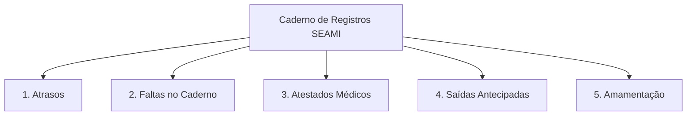

# 📖 04. Módulo II: Caderno de Registros SEAMI

O **Caderno de Registros SEAMI** (`/caderno/`) é o livro digital oficial da instituição para o registro circunstanciado de todos os eventos que impactam a rotina da criança na escola.

---

## 📌 1. Tipos de Ocorrência no Caderno

O sistema categoriza as ocorrências através do enum `TipoOcorrencia`:

---

## ⏰ 2. Controle de Atrasos (`/caderno/atrasos/`)

Registra entradas de alunos após o horário limite regulamentar.

* **Horário Padrão de Entrada**: `08:00` (Matutino/Integral) e `13:00` (Vespertino).
* **Campos Registrados**:
  * Horário Real de Chegada (ex: `08:35`).
  * **Minutos de Atraso Calculados**: O sistema calcula automaticamente os minutos acumulados (ex: `35 minutos`).
  * **Motivo / Justificativa**: Ex: *Trânsito*, *Consulta médica prévia*, *Imprevisto familiar*.
  * **Justificado (Sim/Não)**: Flag para relatórios analíticos de pontualidade.

---

## 🩺 3. Atestados Médicos (`/caderno/atestados/`)

Documenta afastamentos de saúde prescritos por profissionais médicos.

* **Campos Obrigatórios**:
  * **Data de Início**: Primeiro dia de afastamento.
  * **Data de Término (`data_fim`)**: Último dia de repouso prescrito.
  * **CID (Classificação Internacional de Doenças)**: Código diagnóstico (opcional ou obrigatório conforme protocolo).
  * **Motivo / Diagnóstico Clínico**: Ex: *Gastroenterite*, *Varicela*, *Resfriado com febre*.
  * **Upload de Documento / Anexo**: Foto ou PDF do atestado médico assinado.
* **Sincronização com a Chamada**:
  * O sistema marca automaticamente todos os dias úteis entre `data` e `data_fim` como **Falta Justificada (`JUSTIFICADO`)** na chamada do professor, com o motivo pré-preenchido.

---

## ❌ 4. Faltas no Caderno (`/caderno/faltas/`)

Utilizado pela Secretaria ou Coordenação para pré-registrar ausências comunicadas pelos pais:

* **Período Único ou Intervalo**: Suporta falta de 1 dia ou períodos prolongados (ex: viagens em família de 5 dias).
* **Comunicação Prévia**: Marcação se a família entrou em contato via WhatsApp/telefone da escola.
* **Reflexo na Frequência**: Atualiza a chamada para que o professor veja a justificativa imediatamente ao abrir o diário de classe.

---

## 🚪 5. Saídas Antecipadas (`/caderno/saidas/`)

Controle de segurança para retirada da criança antes do encerramento do turno:

* **Horário da Retirada**: Registro da hora exata da saída.
* **Pessoa que Retirou**: Nome e documento do responsável (verificação de autorização cadastral).
* **Retorno no Mesmo Dia**: Flag indicando se a criança retornará após atendimento/consulta externa.

---

## 🍼 6. Amamentação (`/caderno/amamentacao/`)

Acompanhamento do acolhimento à lactante no berçário:

* **Horário da Visita**: Início e fim da amamentação presencial.
* **Observações**: Receptividade da criança e volume complementar oferecido.

---

## 🔄 7. Regras de Sincronização Automática com a Chamada

O SEAMI possui sinais internos (`Django Signals`) que mantêm o Caderno e a Chamada Diária sincronizados:

1. **Ao Salvar Ocorrência (Falta ou Atestado)**:
   - Dispara `sincronizar_ocorrencia_com_presenca`.
   - Localiza ou projeta o `RegistroPresenca` para as datas do período.
   - Aplica `status = JUSTIFICADO` (ou `AUSENTE`) e inclui o motivo na observação.
2. **Ao Excluir ou Alterar Datas da Ocorrência**:
   - Dispara o recálculo automático (`recalcular_presenca_para_data`).
   - Se o dia já tiver chamada oficial lançada pelo professor, reverte o status para a marcação original de sala (`status_chamada`).
   - Se a data for futura (`data > hoje`) e não possuir chamada oficial lançada, **remove o registro antecipado órfão**, mantendo o banco limpo e consistente.
