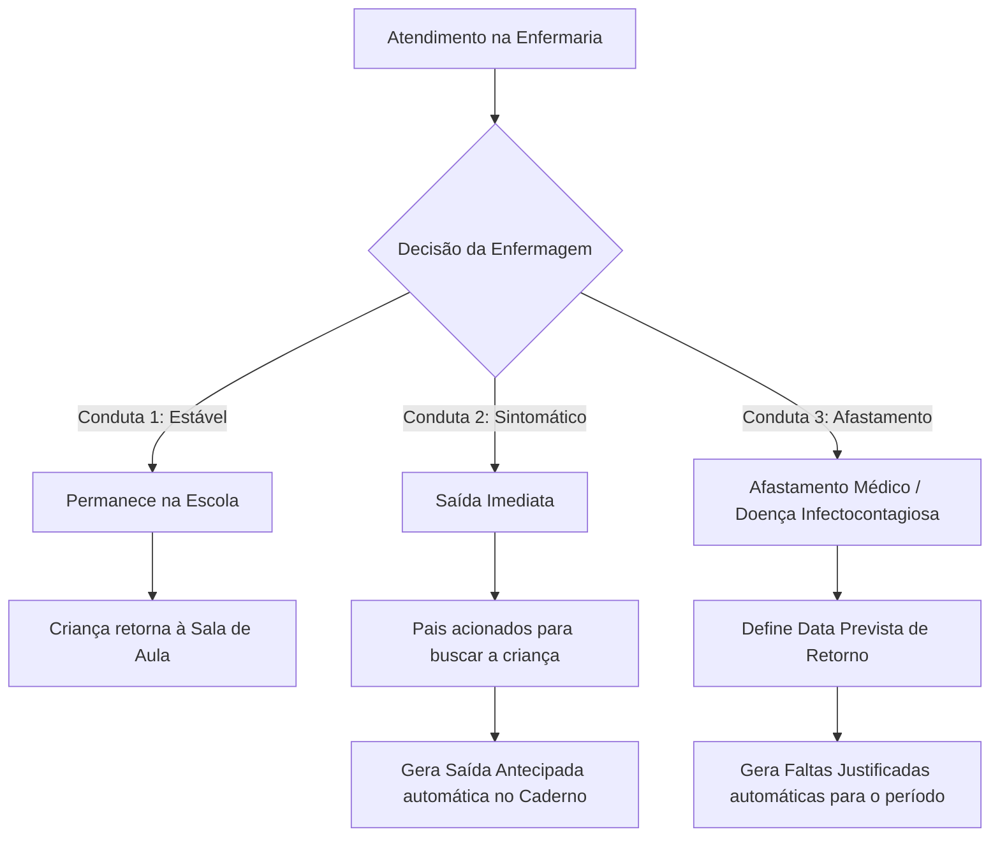

# 🏥 05. Módulo III: Gestão de Enfermagem e Saúde Infantil

O **Módulo de Enfermagem** (`/enfermaria/`) é o prontuário digital ambulatorial do SEAMI, garantindo o acompanhamento de saúde das crianças, administração de medicamentos autorizados e integração imediata com os módulos de registros e frequência.

---

## 🩺 1. Atendimento Clínico Ambulatorial

Ao acolher uma criança na enfermaria, o profissional de saúde registra o atendimento através do formulário completo:

### 1.1. Dados do Atendimento (`AtendimentoEnfermaria`)
* **Aluno(a)**: Identificação da criança.
* **Data e Horário do Atendimento**: Registro cronológico preciso.
* **Motivo Principal da Triagem**:
  * *Febre / Temperatura Elevada*
  * *Queda / Escoriação / Trauma leve*
  * *Sintomas Respiratórios / Coriza / Tosse*
  * *Desconforto Abdominal / Cólica / Vômito*
  * *Administração de Medicamento de Rotina com Receita*
  * *Reação Alérgica / Picada de Inseto*
* **Temperatura e Sinais Vitais**: Aferição da temperatura corporal (°C).
* **Conduta / Procedimento Realizado**: Higienização, compressa, repouso, medicação ministrada e dosagem.
* **Anexo de Receita / Laudo**: Upload do receituário médico fornecido pelos pais.

---

## 🔀 2. Fluxo de Decisão e Desfecho Clínico

Ao finalizar o atendimento, a Enfermagem define uma das 3 condutas:

---

## ⚡ 3. Automações Integradas com outros Módulos

O módulo de enfermagem executa automações através dos serviços `services.py`:

### 3.1. Saída Imediata Marcada (`saida_imediata = True`)
* O sistema cria automaticamente uma **Saída Antecipada (`OcorrenciaCaderno`, tipo `saida`)** com o horário do atendimento e o motivo registrado, notificando a Direção e poupando retrabalho.

### 3.2. Afastamento Médico com Data de Retorno (`retornara_dia_seguinte = False`)
* Se a criança for liberada com atestado ou recomendação de ficar em casa até determinada data (`data_retorno_prevista`):
  1. Cria uma **Falta Justificada (`OcorrenciaCaderno`, tipo `falta`, `justificado=True`)** cobrindo todos os dias úteis até a data prevista de retorno.
  2. Atualiza a chamada diária (`RegistroPresenca`) como **`JUSTIFICADO`** com a observação médica institucional.

### 3.3. Reversão Automática (`reverter_automacoes_enfermaria`)
* Se um atendimento de enfermagem for cancelado ou corrigido:
  1. A saída antecipada gerada é excluída.
  2. As faltas justificadas automáticas do período são removidas.
  3. Os registros de chamada futuros e sem diário oficial de sala são limpos automaticamente.

---

## 📊 4. Painel e Histórico Médico da Criança

* **Prontuário Individual**: A Enfermagem e a Direção podem consultar todo o histórico clínico da criança ao longo do ano letivo (frequência de febres, quedas, alergias e medicamentos recorrentes).
* **Relatório para Pediatras / Família**: Exportação em PDF do histórico de atendimentos e intercorrências para acompanhamento com o pediatra da criança.
