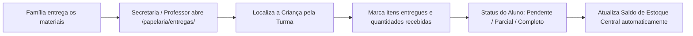

# 🎨 06. Módulo IV: Gestão de Papelaria & Materiais Pedagógicos

O **Módulo de Papelaria** (`/papelaria/`) organiza o catálogo de suprimentos escolares, o controle de estoque de insumos de sala de aula e berçário, a conferência de kits de materiais entregues pelas famílias e a emissão da lista oficial de materiais aos pais.

---

## 📦 1. Catálogo e Controle de Estoque (`/papelaria/estoque/`)

### 1.1. Cadastro de Itens (`ItemPapelaria`)
Cada suprimento pedagógico ou de higiene possui:
* **Nome e Especificação**: Nome do item, marca recomendada e detalhes técnicos (ex: *Tinta Guache Atóxica 250ml - Acrilex*).
* **Categoria**:
  * *Papéis e Cartolinas*
  * *Colas e Adesivos*
  * *Pintura e Desenho*
  * *Material de Escritório*
  * *Higiene e Cuidados (Fraldas, Lenços, Sabonete líquido)*
  * *Decoração e Eventos*
  * *Diversos*
* **Unidade de Medida**: `Unidade`, `Resma`, `Cartela`, `Litro/Frasco`, `Caixa`, `Pacote`, `Bloco`, `Rolo`, `Metro`, `Kit`.
* **Saldo Atual e Estoque Mínimo**:
  * O sistema gera alertas visuais quando o saldo de um item atinge ou fica abaixo do `estoque_minimo` cadastrado.

### 1.2. Movimentações de Estoque (`MovimentacaoEstoque`)
Toda alteração de saldo é auditada e classificada em:
1. **`ENTRADA`**: Compras institucionais, doações ou reposição geral.
2. **`SAIDA`**: Baixa para consumo em sala de aula, oficinas pedagógicas ou berçário.
3. **`AJUSTE`**: Correções de contagem em auditorias e inventários periódicos.

---

## 🎒 2. Kits de Material por Sala de Aula

Cada faixa etária possui demandas pedagógicas e de cuidados específicas.

* O sistema permite configurar a lista de itens necessária para cada turma:
  * **Sala Amizade (6-12m)**: Foco em estimulação sensorial, papéis texturizados e higiene de berçário.
  * **Sala União (12-18m)**: Tintas atóxicas laváveis, massinha comestível/atóxica e folhas de alta gramatura.
  * **Sala Felicidade (18-24m)**: Giz de cera ergonômico, pincéis grossos e colas bastão.
  * **Sala Carinho (24-30m)**: Tesouras sem ponta, papéis coloridos e materiais de colagem.
  * **Sala Alegria (30-36m)**: Cadernos de desenho, jogos pedagógicos e materiais de motricidade fina.

---

## 📋 3. Controle de Entrega por Aluno (`/papelaria/entregas/`)

Permite à Secretaria e aos Professores registrar e conferir a entrega dos materiais solicitados aos responsáveis:

---

## 📄 4. Relatório Oficial para os Pais (`/papelaria/relatorio-pais/`)

Gera uma visão limpa, elegante e profissional para envio às famílias no período de matrícula e rematrícula:

* **Filtro por Sala de Aula**: Exibe a lista exata da turma do aluno.
* **Quantidades Sugeridas aos Pais**: Ex: *02 pacotes*, *01 caixa de 12 cores*, *04 unidades*.
* **Notas de Rodapé Explicativas**:
  * `(*)` *Sugestão de marca visando durabilidade e segurança pedagógica*.
  * `(**)` *Materiais de uso contínuo de higiene e berçário*.
* **Impressão & Download em PDF**: Botão otimizado para gerar PDF institucional pronto para impressão ou compartilhamento via e-mail / aplicativo escolar.
