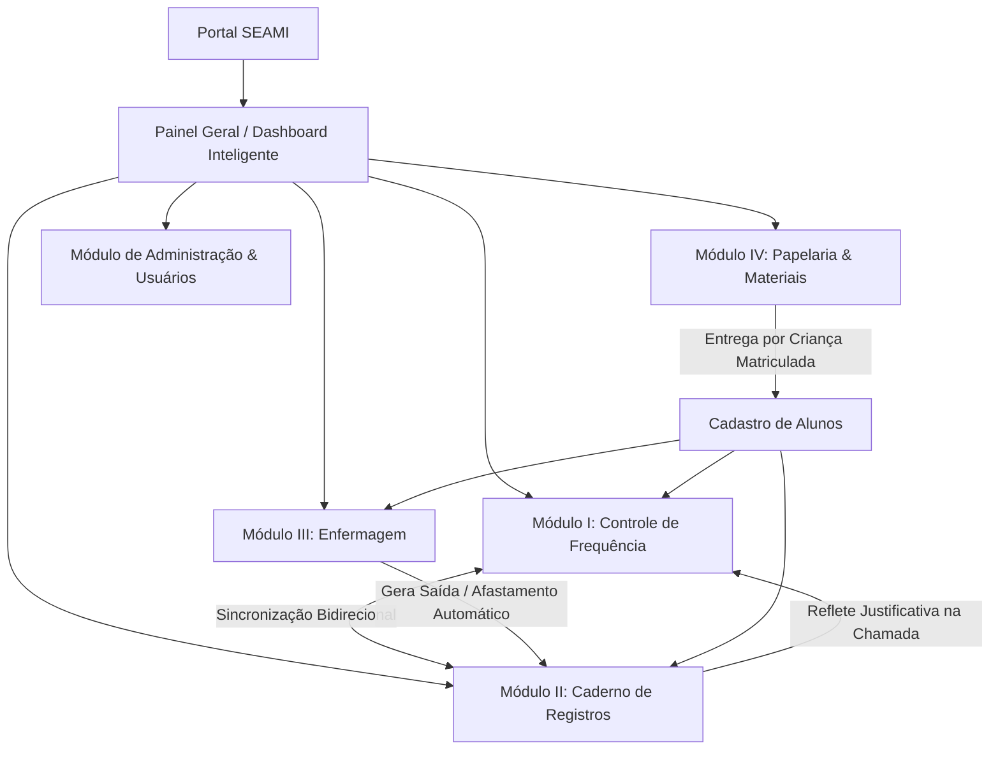

# 📚 Documentação Oficial do Sistema SEAMI
## Acompanhamento e Gestão de Presença Infantil

Bem-vindo à documentação técnica e operacional do **SEAMI (Sistema Educacional de Acompanhamento e Monitoramento Infantil)**. Este repositório de documentos detalha todos os fluxos de trabalho, regras de negócio, permissões de acesso por perfil e a integração entre os módulos do sistema.

---

## 🗂️ Índice da Documentação

| Arquivo | Título & Tema | Descrição |
| :--- | :--- | :--- |
| **[01. Perfis e Permissões](01_perfis_e_permissoes.md)** | `01_perfis_e_permissoes.md` | Detalhamento dos perfis (Superadmin/Master, Direção, Coordenação, Professores, Auxiliares e Enfermagem), matriz de permissões e navegação. |
| **[02. Ciclo de Vida do Aluno](02_ciclo_de_vida_aluno.md)** | `02_ciclo_de_vida_aluno.md` | Da matrícula inicial, alocação em salas (Amizade, União, Felicidade, Carinho, Alegria), transições de etapa, desligamento e reativação. |
| **[03. Módulo I: Controle de Frequência](03_modulo_frequencia_e_chamada.md)** | `03_modulo_frequencia_e_chamada.md` | Lançamento diário de chamada por turnos (Integral, Matutino, Vespertino), validação de status (P, F, FJ), consulta e relatórios analíticos. |
| **[04. Módulo II: Caderno de Registros](04_caderno_de_registros_seami.md)** | `04_caderno_de_registros_seami.md` | Registro de faltas, atestados médicos com CID, controle de atrasos (minutos), saídas antecipadas, amamentação e sincronização com a chamada. |
| **[05. Módulo III: Enfermagem](05_modulo_enfermaria.md)** | `05_modulo_enfermaria.md` | Atendimento clínico infantil, administração de medicamentos, controle de saída imediata, afastamentos e automações de prontuário. |
| **[06. Módulo IV: Papelaria & Materiais](06_modulo_papelaria_e_materiais.md)** | `06_modulo_papelaria_e_materiais.md` | Gestão de estoque pedagógico, kits de materiais por sala, entregas individuais por aluno, auditoria de estoque e relatório oficial aos pais. |

---

## 🏛️ Arquitetura Geral e Visão dos Módulos

---

## 🚀 Guia Rápido de Acesso às Rotas Principais

| Módulo / Funcionalidade | Rota URL | Perfil Mínimo |
| :--- | :--- | :--- |
| **Painel Geral (Dashboard)** | `/dashboard/` | Qualquer autenticado |
| **Lançar Chamada Diária** | `/presencas/chamada/` | Professor / Admin |
| **Consulta & Relatórios de Chamada** | `/presencas/chamada/consulta/` | Professor (suas salas) / Admin (todas) |
| **Alunos & Matrículas** | `/presencas/alunos/` | Professor (suas salas) / Admin (todas) |
| **Caderno de Registros (Atrasos, Faltas, Atestados)** | `/caderno/` | Qualquer autenticado |
| **Módulo de Enfermagem** | `/enfermaria/` | Enfermeira / Direção / Master |
| **Estoque de Papelaria** | `/papelaria/estoque/` | Qualquer autenticado |
| **Entregas de Material por Aluno** | `/papelaria/entregas/` | Qualquer autenticado |
| **Lista de Material para os Pais** | `/papelaria/relatorio-pais/` | Qualquer autenticado |
| **Gestão de Usuários & Convites** | `/accounts/usuarios/` | Diretor / Master Admin |
| **Central de Exportação Geral** | `/central-exportacao/` | Diretor / Master Admin |
